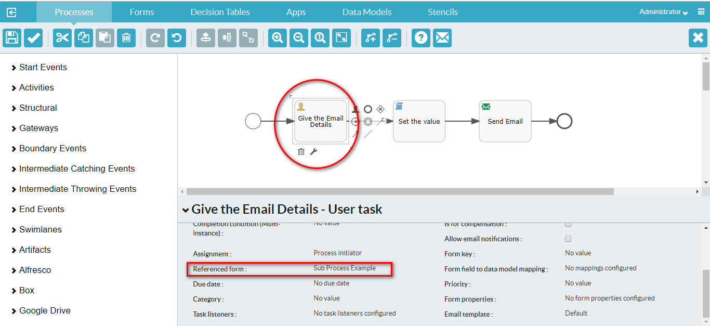
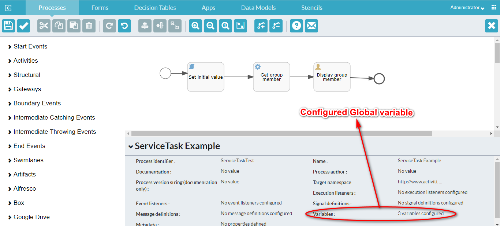
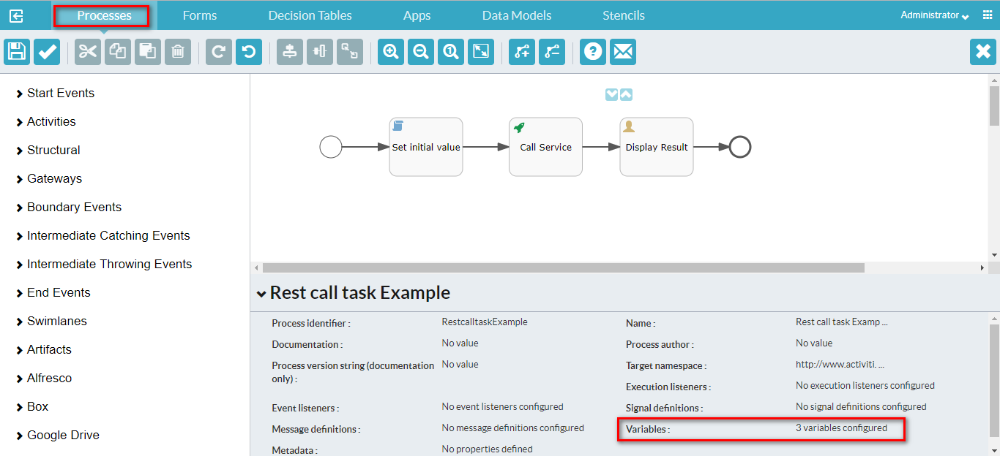
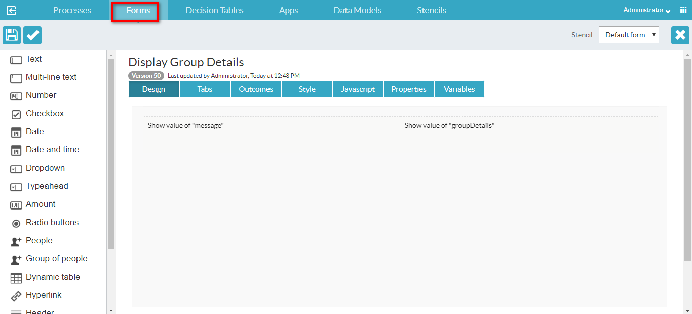
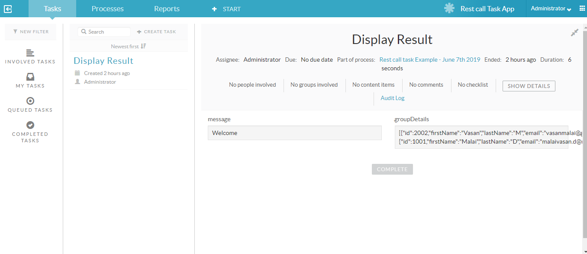
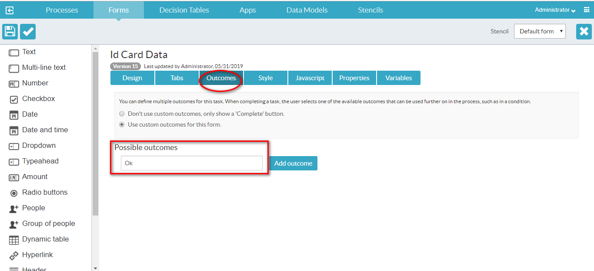
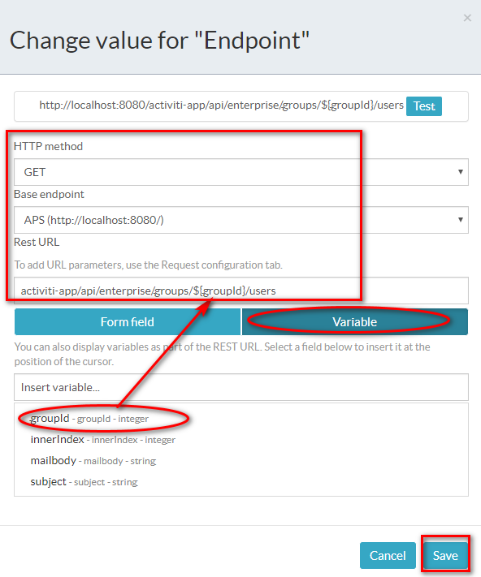
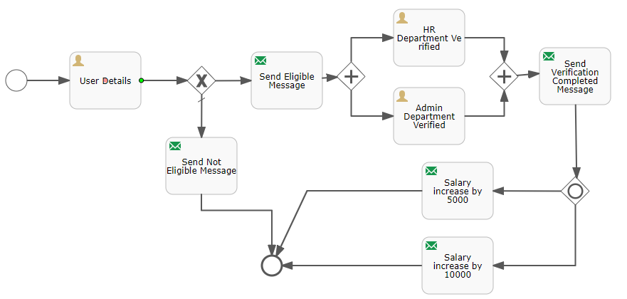
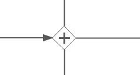

**BPM - An Overview**

Business process management is a discipline in operations management in which people use various methods to discover, model, analyze, measure, improve, optimize, and automate business processes. BPM focuses on improving corporate performance by managing business processes.

**Alfresco Process Services**

Alfresco Process Services (powered by Activiti) is an enterprise Business Process Management (BPM) solution targeted at business people and developers. At its core is a high performance open-source business process engine based on Activiti with the flexibility and scalability to handle a wide variety of critical processes. Alfresco Process Services provides a powerful suite of end user tools and integrates with a range of enterprise systems, including Alfresco Content Services, Box and Google Drive.

Alfresco Process Services enables: Users to access all information, tasks, and documents to quickly and efficiently complete key business processes. Collaboration with users working as a team to complete tasks.

**Getting Started with Alfresco Process Services**

With Alfresco Process Services it's easy to create, publish, and use process models and apps. Before you begin, make sure that you've following the instructions in Installing Alfresco Process Services.

Most BPM solutions are too rigid to allow users to adjust for non-routine situations, which results in slowing the flow of business. Alfresco Process Services enables:

* Users to access all information, tasks, and documents to quickly and efficiently complete key business processes

* Collaboration with users working as a team to complete tasks. Users can allocate tasks and subtasks to individuals, allowing users to address non-routine tasks

* Group and individual tasks inboxes allow organizations to model processes to support a wide range of business scenarios

**APS Architecture**

**Using Alfresco Process Services**

The Alfresco Process Services Landing Page continues to provide a user interface for managing your tasks but with the additional features for process design and profile management.           The Landing Page is your user interface to Process Services. Each tile gives you tools for distinct sets of tasks.

The Landing Page is the starting point from which you can use:

[App Designer](https://docs.alfresco.com/process-services1.8/topics/App_Designer_app.html) - Design your process

[My Tasks](https://docs.alfresco.com/process-services1.8/topics/task_app.html) - View your task inbox or queue

[Profile management / Identity management](https://docs.alfresco.com/process-services1.8/topics/identity_management.html) - Manage user and group capabilities

[Analytics](https://docs.alfresco.com/process-services1.8/topics/analytics_app.html)- Generate reports on process performance

**Profile management** will appear will appear for you only if you are a user. This is where you manage your personal information. If you have administrator capabilities, then **Profile management** will be displayed as **Identity management**. Use this tile to access your profile page as well as to manage user, group, and capability management pages for your tenant or the whole system.

Your landing page is dynamic, and new tiles will appear when you create new process apps in the App Designer and deploy them in the Task App. If you are an administrator, your landing page is slightly different. Instead of the Profile management tile, you’ll find a more powerful set of tools called the Identity management tile.

**BPMN Editor**

With the BPMN editor you can create process definitions using the capabilities of BPMN 2.0. You build your process by dragging and dropping from a palette of grouped components to a canvas on which your process diagram is built.

The BPMN editor is structured into several areas:

**Palette** - On the left side of BPMN editor is the palette, which consists of collapse-able groups of  BPMN objects.

**Canvas** - On the right side of BPMN editor is the canvas, where the BPMN objects can be added to create a process model.

**Properties sheet** - Below the canvas is the properties sheet, which shows the properties of the selected BPMN object on the canvas, or if no BPMN object is selected, the properties of the process itself. You can click on any of the properties to modify its value. The property sheet is collapse-able to allow you more screen space to view your process diagram.

**Toolbar** - The toolbar is displayed on the top with a set of grouped command icons.

There are two ways of adding BPMN objects to your process:

* Use the controls that appear when you click on a current object icon. Using this method will create a valid connector between the current event icon and the new event icon.

* Drag and drop an object icon from the palette. In this case you add flows to the current event icons in the process yourself by picking the icons from the palette.

The following object groups are shown in a collapsible list in the palette. The groups consist of all the objects available in the BPMN 2.0 specification, and additional Alfresco Process Services extensions such as the Publish to Alfresco task, Publish to Box, Publish to Google Drive.

**Start events** - A start event indicates where a process starts.

**Activities** -  An activity describes a single item of work to be performed in a process.

**Structural components** - You use structural components to group multiple components in a sub process to reuse in a parent process definition, and to embed and call other process definitions from inside your own process.

**Gateways** - You use gateways to control the flow of execution in your process.

**Boundary events** - You use boundary events to handle an event associated with an activity.

**Intermediate catching events** - An intermediate catching event is a step in the process where the process needs to wait for a specific trigger

**Intermediate throwing events** - An intermediate throw event is used to explicitly throw an event of a certain type.

**End events** - You use an end event to signify the end of a process or sub-process, or the end of a path in a process or sub-process.

**Swimlanes** - You use swimlanes to display activities in your process divided by business function or participant group.

**1. Start Event:**

Start events define where a Process or Subprocess starts. The process engine supports different types of start events:

**1.1 None Start Event or Start Event**

A start event with an unspecified trigger.

Undefined trigger to start of process or Entry point to a Sub Process.

A none start event can have a start form. If so, the start form will be displayed when selecting the process definition from the processes list. Note that a process instance is not started until the start form is submitted. A none start event without a form will simply have a button displayed to start the process instance.

It is visualized as a circle with no icon.

<table>
  <tr>
    <td>S.no</td>
    <td>Property</td>
    <td>Description</td>
  </tr>
  <tr>
    <td>1</td>
    <td>Id</td>
    <td>A unique identifier for this element.</td>
  </tr>
  <tr>
    <td>2</td>
    <td>Name</td>
    <td>A name for this element.</td>
  </tr>
  <tr>
    <td>3</td>
    <td>Documentation</td>
    <td>A description of this element.</td>
  </tr>
  <tr>
    <td>4</td>
    <td>Execution listeners</td>
    <td>Execution listeners configured for this element instance. An execution listener is a piece of logic that is not shown in the diagram and can be used for technical purposes.</td>
  </tr>
  <tr>
    <td>5</td>
    <td>Process Initiator</td>
    <td>The process variable in which the user ID of the initiator of this instance should be stored.</td>
  </tr>
  <tr>
    <td>6</td>
    <td>Form key</td>
    <td>A key that provides a reference to a form. This property is available for compatibility with Activiti , but should not be used directly when using Forms. Use the Referenced form property instead.</td>
  </tr>
  <tr>
    <td>7</td>
    <td>Referenced form</td>
    <td>A form reference.</td>
  </tr>
  <tr>
    <td>8</td>
    <td>Form properties</td>
    <td>A form definition with a list of form properties. Form properties are the way forms are defined in the community version of Alfresco Process Services. Configuring them has no impact on the rendered form in the Alfresco Process 
Services, the Referenced form property should be used instead.</td>
  </tr>
</table>

**Example**

In this BPMN diagram example, the process shows that we first get our eggs, then scramble them and eat them for breakfast. We don’t indicate why the process was started. It could be because we were hungry, because we’re on a dietary schedule, or because our mom told us we had to eat our breakfast. We don’t know, or care. Trying to figure out what triggers the egg scrambling process doesn’t help us understand the process any better – so we use the none start event.

**1.2 Start Timer Event**

A timer start event initiates a process instance at specific time. You can use it both for processes which must start only once and for processes that must start in repeated time intervals.

Note that a process instance started by a timer start event can’t have a start form, as it is started by the system. Similarly, it does not have a process initiator like a none start event. As such when assigning tasks later on in the process definition, keep in **mind that the assignment 'assigned to process initiator'** **will not work**.

**A subprocess can’t have a timer start event.**

It is visualized as a circle with a clock icon

<table>
  <tr>
    <td>S.No</td>
    <td>Property</td>
    <td>Description</td>
  </tr>
  <tr>
    <td>1</td>
    <td>Id</td>
    <td>A unique identifier for this instance.</td>
  </tr>
  <tr>
    <td>2</td>
    <td>Name</td>
    <td>A name for this element.</td>
  </tr>
  <tr>
    <td>3</td>
    <td>Documentation</td>
    <td>A description of this element.</td>
  </tr>
  <tr>
    <td>4</td>
    <td>Execution listeners</td>
    <td>Execution listeners configured for this instance. An execution listeners is a piece of logic that is not shown in the diagram and can be used for technical purposes.</td>
  </tr>
  <tr>
    <td>5</td>
    <td>Time Cycle</td>
    <td>A timer cycle defined in http://en.wikipedia.org/wiki/ISO_8601 format, for example: R3/PT10H.</td>
  </tr>
  <tr>
    <td>6</td>
    <td>Time Date in ISO-8601</td>
    <td>A point in time defined as a http://en.wikipedia.org/wiki/ISO_8601 date, for example: 2015-04-12T20:20:32Z.</td>
  </tr>
  <tr>
    <td>7</td>
    <td>Time Duration</td>
    <td>A period of time defined as a http://en.wikipedia.org/wiki/ISO_8601duration, for example: PT5M.</td>
  </tr>
</table>

**Example**

The timer event is used in BPMN diagrams to indicate that the process begins at a set time or date. It can also be used for processes that repeat on a schedule (hourly, daily, etc).

In our example, on the actor’s wedding anniversary, he buys a gift, gives it to his spouse, and then enjoys their anniversary. This process is triggered by the timing of the anniversary.

**1.3 Start Signal Event**

A signal start event starts a process instance using a named signal. The signal is fired from a process instance using the intermediary signal throw event (or programmatically through the java or REST API). In both cases, a process instance for any process definitions that have a signal start event with the same name are started. You can select a synchronous or asynchronous start of the process instances.

A signal start event is visualized as a circle with a triangle inside. The triangle is white inside.

<table>
  <tr>
    <td>S.No</td>
    <td>Property</td>
    <td>Description</td>
  </tr>
  <tr>
    <td>1</td>
    <td>Id</td>
    <td>A unique identifier for this element.</td>
  </tr>
  <tr>
    <td>2</td>
    <td>Name</td>
    <td>A name for this element.</td>
  </tr>
  <tr>
    <td>3</td>
    <td>Documentation</td>
    <td>A description of this element.</td>
  </tr>
  <tr>
    <td>4</td>
    <td>Execution listeners</td>
    <td>Execution listeners configured for this instance. An execution listeners is a piece of logic that is not shown in the diagram and can be used for technical purposes.</td>
  </tr>
  <tr>
    <td>5</td>
    <td>Signal reference</td>
    <td>The name of the signal that initiates this event. Note that signal references are configured on the root level of the process instance and then linked to the signal start event via this property. To configure it, deselect any other element and click the Signal definitions property.</td>
  </tr>
</table>

**1.4 Start Message Event**

A message start event starts a process instance using a named message. It is mainly used for starting process instances from external systems. It is depicted as a circle with an envelope icon inside. The envelope is white inside.

When you deploy a process definition with one or more message start events, consider the following points:

* The name of the message start event must be unique across the whole process definition. Alfresco Process Services will throw an exception on deployment of a process definition with two or more message start events that reference the same message or with two or more message start events that reference messages with the same name.

* The name of the message start event must be unique across all deployed process definitions. Alfresco Process Services will throw an exception on deployment of a process definition with one or more message start events that reference a message with the same name as a message start event already deployed in a different process definition.

* When a new version of a process definition is deployed, the message subscriptions of the previous version are canceled. This is also true for message events that are not present in the new version.

<table>
  <tr>
    <td>S.No</td>
    <td>Property</td>
    <td>Description</td>
  </tr>
  <tr>
    <td>1</td>
    <td>Id</td>
    <td>A unique identifier for this element.</td>
  </tr>
  <tr>
    <td>2</td>
    <td>Name</td>
    <td>A name for this element.</td>
  </tr>
  <tr>
    <td>3</td>
    <td>Documentation</td>
    <td>A description of this element.</td>
  </tr>
  <tr>
    <td>4</td>
    <td>Execution listeners</td>
    <td>Execution listeners configured for this instance. An execution listener is a piece of logic that is not shown in the diagram and can be used for technical purposes.</td>
  </tr>
  <tr>
    <td>5</td>
    <td>Message reference</td>
    <td>The name of the message that initiates this event. Note that messages are configured on the root level of the process instance and then linked to the message start event via this property. To configure it, deselect any other element and click the 'Message definitions' property.</td>
  </tr>
</table>

**Example**

When a process is initiated by an outside actor sending us a message (telling us to start the event), we use the message start event.

This BPMN diagram example shows a process of getting water, giving it to a child, and returning to bed. The process is initiated by the receipt of a message. We become aware that the child is complaining of thirst and unable to sleep. When we receive that message, we initiate the process of getting water for the child.

**1.5 Start Error Event**

An error start event triggers an event Sub-Process. An error start event can’t be used for starting a process instance.

It is visualized as a circle with lightning icon inside. The icon is white inside.

<table>
  <tr>
    <td>S.No</td>
    <td>Property</td>
    <td>Description</td>
  </tr>
  <tr>
    <td>1</td>
    <td>Id</td>
    <td>A unique identifier for this element.</td>
  </tr>
  <tr>
    <td>2</td>
    <td>Name</td>
    <td>A name for this element.</td>
  </tr>
  <tr>
    <td>3</td>
    <td>Documentation</td>
    <td>A description of this element.</td>
  </tr>
  <tr>
    <td>4</td>
    <td>Execution listeners</td>
    <td>Execution listeners configured for this instance. An execution listeners is a piece of logic that is not shown in the diagram and can be used for technical purposes.</td>
  </tr>
  <tr>
    <td>5</td>
    <td>Error reference</td>
    <td>The name of the error that initiates this event. This reference needs to match the error identifier thrown by the event that throws the particular error.</td>
  </tr>
</table>

**2. Activities:**

An activity describes a single item of work to be performed in a process. An activity is always visualized as a rectangle with rounded corners.

	

**2.1 User Task**

A user task enables you to model work to be done by a human actor. When process execution arrives at a user task in the process definition, it creates a new task in the task list of the assignee or assignees defined in the task. A user task is depicted as a rounded rectangle with a user icon on the top-left corner.

**Example:**

**Create process and change the property for Variable**

**NOTE:** In this way, we can set the global variables which we can use in the model.

**Mapping the variables**

**NOTE:** In this way, we can map the variables.

This example is continued in Script task and then mail task.

**2.2 Service Task**

Use a service task to invoke an external Java class or execute an expression. A service task is visualized as a rounded rectangle with a cog icon inside.

**Example**

Required: 

1. Identity management--->Organization-->Create group and Add user that group

2. Get the group id for below image

3. Webservice Ref. APS API given link.

**http://localhost:8080/activiti-app/api-explorer.html**

**Process:**

**Configure Global variables for the Process:**

**Global variable Table**

<table>
  <tr>
    <td>S.No</td>
    <td>Variable name</td>
    <td>Variable Type</td>
  </tr>
  <tr>
    <td>1</td>
    <td>message</td>
    <td>string</td>
  </tr>
  <tr>
    <td>2</td>
    <td>groupDetails</td>
    <td>string</td>
  </tr>
  <tr>
    <td>3</td>
    <td>groupId</td>
    <td>string</td>
  </tr>
</table>

**Set Initial value:**

<table>
  <tr>
    <td>S.No</td>
    <td>Property</td>
    <td>Value</td>
  </tr>
  <tr>
    <td>1</td>
    <td>Script format</td>
    <td>javascript</td>
  </tr>
  <tr>
    <td>2</td>
    <td>Script</td>
    <td>execution.setVariable("groupId", 3003);</td>
  </tr>
</table>

**Get Group Members:**

**Display Group Members:**

	

**Backend Code:**

For backend code, refer this [link](https://github.com/muraai/aps-training-materials/blob/master/src/main/java/com/activiti/extension/conf/MyJavaDelegate.java).

**Make the above java code to jar file  and put on the folder path:**

C:\Program Files (x86)\alfresco\process-services-1.9.0.3\tomcat\webapps\activiti-app\WEB-INF\lib

**Output:**

**2.3 Script Task**

A script task defines a JavaScript script or other script language (JSR-223 compatible language) that is executed when a process instance executes this step. A script task is visualized as a rounded rectangle with a paper icon inside.

For script task, change the properties in both the files.

1. C:\Program Files (x86)\alfresco\process-services-1.9.0.3\tomcat\lib\activiti-app.properties

2. C:\Program Files (x86)\alfresco\process-services-1.9.0.3\tomcat\webapps\activiti-app\WEB-INF\classes\META-INF\activiti-app\activiti-app.properties

	validator.editor.bpmn.disable.executionlistener=false

	validator.editor.bpmn.disable.cameltask=false

	validator.editor.bpmn.disable.muletask=false

	validator.editor.bpmn.disable.mailtask=false

	**validator.editor.bpmn.disable.scripttask=false**

	**validator.editor.bpmn.disable.scripttask.groovy=false**

	validator.editor.bpmn.disable.manualtask=false

	validator.editor.bpmn.disable.businessruletask=false

	validator.editor.bpmn.disable.servicetask=false

	validator.editor.bpmn.disable.intermediatethrowevent=false

	validator.editor.bpmn.disable.startevent.timer=false

	validator.editor.bpmn.disable.startevent.signal=false

	validator.editor.bpmn.disable.startevent.message=false

	validator.editor.bpmn.disable.startevent.error=false

	validator.editor.bpmn.disable.startevent.timecycle=false

	validator.editor.bpmn.disable.loopback=false

	validator.editor.bpmn.limit.servicetask.only-class=false

	validator.editor.bpmn.limit.multiinstance.loop=false

	validator.editor.bpmn.limit.usertask.assignment.only-idm=false

	editor.form.javascript.disable=false

	javascript.secure-scripting.enabled=false

	#only classes in activiti/javascript-whitelist-classes.conf will be allowed

	**javascript.secure-scripting.enable-class-whitelisting=true**

	#max stack depth to avoid stackoverflow exceptions 

	javascript.secure-scripting.max-stack-depth=100

	#max execution time in milliseconds

	javascript.secure-scripting.max-execution-time=3000

	#max memory in bytes (eg. 5242880 = 5MB) 

	javascript.secure-scripting.max-memory=5242880

	#number instructions to execute before checking max memory & max execution time 

	javascript.secure-scripting.instructions-before-callback=100

Uncomment all the properties in **process-services-1.9.0.3\tomcat\webapps\activiti-app\WEB-INF\classes\activiti\whitelisted-scripts.conf**

**Example**

**Change the property for**

<table>
  <tr>
    <td>S.No</td>
    <td>Property</td>
    <td>Value</td>
  </tr>
  <tr>
    <td>1</td>
    <td>Script Format</td>
    <td>javascript</td>
  </tr>
  <tr>
    <td>2</td>
    <td>Script</td>
    <td>execution.setVariable("emailid", 'example@gmail.com');</td>
  </tr>
</table>

	

**2.4 Mail Task**

You can enhance your business process with this automatic mail service task that sends emails to one or more recipients. The task supports normal email features such as cc lists, bcc lists, and HTML content. The mail task is depicted as a rounded rectangle with an envelope icon in the top-left corner.

**Example**

**Change the To Property:**

**Change the Subject Property:**

**Change the Text Property:**

**Output**

**2.5 Rest Call Task**

The rest call task is used to communicate with a REST endpoint. The endpoint can be defined in the process definition, or it can be defined company-wide by an administrator. In the latter case, a logical name is all that is needed. A rest call task is visualized as a rounded rectangle with a rocket icon the top-left corner.

**Configure Endpoints**

Go to Identity management -->Tenants-->Endpoints

**Example**

**Create Process and property variable**

**Set initial value**

<table>
  <tr>
    <td>S.No</td>
    <td>Property</td>
    <td>Value</td>
  </tr>
  <tr>
    <td>1</td>
    <td>Script format</td>
    <td>javascript</td>
  </tr>
  <tr>
    <td>2</td>
    <td>Script</td>
    <td>execution.setVariable("groupId", 3003);
execution.setVariable("message", 'Welcome');
</td>
  </tr>
</table>

**Call Service**

**Change the property for Endpoint**

**Change the property for Response mapping**

**Display  Result**

**Display Group Details Form**

**Output**

**2.6 Decision Task**

You use a decision task to select a decision table while designing your process model. A decision table enables you to define a set of business rules that will be applied when it’s executed. See the LINKHERE section for more information. A decision task is depicted as a rounded rectangle with a table icon the top-left corner.

**Example**

For Decision task, change the property in both the files.

1. C:\Program Files (x86)\alfresco\process-services-1.9.0.3\tomcat\lib\activiti-app.properties

2. C:\Program Files (x86)\alfresco\process-services-1.9.0.3\tomcat\webapps\activiti-app\WEB-INF\classes\META-INF\activiti-app\activiti-app.properties

	**validator.editor.dmn.expression=true**

**Create Process And Add the property for variables**

**Submit the student details**

**Student Form**

**Marks Calculation**

<table>
  <tr>
    <td>S.No</td>
    <td>Property</td>
    <td>Value</td>
  </tr>
  <tr>
    <td>1</td>
    <td>Script Format</td>
    <td>javascript</td>
  </tr>
  <tr>
    <td>2</td>
    <td>Script</td>
    <td>execution.setVariable("total", execution.getVariable("mark1")+execution.getVariable("mark2")+execution.getVariable("mark3"));
execution.setVariable("avg", execution.getVariable("total")/3);
</td>
  </tr>
</table>

**Grade Calculation**

**Add Rules**

**Display Result**

**Student Display Form**

**Output**

For more examples, refer this [link](https://docs.alfresco.com/process-services1.9/topics/business_rules_decision_tables.html).

**2.7 Generate Document Task**

The generate document task generates a document (Word or PDF) and stores the reference to the document as a process variable. The document is based on a (Word) template that describes how the document needs to be rendered, using process variables and various constructs (such as if-clauses and loops). See the Developer Guide on how to use the generate document task. A generate document task appears as a rounded rectangle with a document icon on the top-left corner.

**Example**

Create Document Template and upload the document to

**Identity management-->Tenants-->Document templates**

For more document template related information, refer this [link](https://docs.alfresco.com/process-services1.9/topics/document_templates.html)

Example for College ID.docx document template [link](https://github.com/muraai/aps-training-materials/blob/master/College%20ID.docx)

**Create Process And Add Variables Property**

<table>
  <tr>
    <td>S.No</td>
    <td>Variable name</td>
    <td>Variable type</td>
  </tr>
  <tr>
    <td>1</td>
    <td>name</td>
    <td>string</td>
  </tr>
  <tr>
    <td>2</td>
    <td>course</td>
    <td>string</td>
  </tr>
  <tr>
    <td>3</td>
    <td>rollno</td>
    <td>string</td>
  </tr>
  <tr>
    <td>4</td>
    <td>batch</td>
    <td>string</td>
  </tr>
  <tr>
    <td>5</td>
    <td>year</td>
    <td>string</td>
  </tr>
  <tr>
    <td>6</td>
    <td>email</td>
    <td>string</td>
  </tr>
  <tr>
    <td>7</td>
    <td>blood</td>
    <td>string</td>
  </tr>
  <tr>
    <td>8</td>
    <td>phone</td>
    <td>string</td>
  </tr>
  <tr>
    <td>9</td>
    <td>street</td>
    <td>string</td>
  </tr>
  <tr>
    <td>10</td>
    <td>post</td>
    <td>string</td>
  </tr>
  <tr>
    <td>11</td>
    <td>talk</td>
    <td>string</td>
  </tr>
  <tr>
    <td>12</td>
    <td>dist</td>
    <td>string</td>
  </tr>
  <tr>
    <td>13</td>
    <td>pin</td>
    <td>string</td>
  </tr>
</table>

**Fill student Details**

**NOTE:** In this way, you can define form Outcomes.

**Map Variables**

<table>
  <tr>
    <td>S.No</td>
    <td>Source process variable</td>
    <td>Form variable</td>
    <td>Target process variable</td>
  </tr>
  <tr>
    <td>1</td>
    <td></td>
    <td>name</td>
    <td>name</td>
  </tr>
  <tr>
    <td>2</td>
    <td></td>
    <td>course</td>
    <td>course</td>
  </tr>
  <tr>
    <td>3</td>
    <td></td>
    <td>rollno</td>
    <td>rollno</td>
  </tr>
  <tr>
    <td>4</td>
    <td></td>
    <td>batch</td>
    <td>batch</td>
  </tr>
  <tr>
    <td>5</td>
    <td></td>
    <td>year</td>
    <td>year</td>
  </tr>
  <tr>
    <td>6</td>
    <td></td>
    <td>email</td>
    <td>email</td>
  </tr>
  <tr>
    <td>7</td>
    <td></td>
    <td>blood</td>
    <td>blood</td>
  </tr>
  <tr>
    <td>8</td>
    <td></td>
    <td>phone</td>
    <td>phone</td>
  </tr>
  <tr>
    <td>9</td>
    <td></td>
    <td>street</td>
    <td>street</td>
  </tr>
  <tr>
    <td>10</td>
    <td></td>
    <td>post</td>
    <td>post</td>
  </tr>
  <tr>
    <td>11</td>
    <td></td>
    <td>talk</td>
    <td>talk</td>
  </tr>
  <tr>
    <td>12</td>
    <td></td>
    <td>dist</td>
    <td>dist</td>
  </tr>
  <tr>
    <td>13</td>
    <td></td>
    <td>pin</td>
    <td>pin</td>
  </tr>
</table>

**Value Initialization**

<table>
  <tr>
    <td>S.No</td>
    <td>Property</td>
    <td>Value</td>
  </tr>
  <tr>
    <td>1</td>
    <td>Script format</td>
    <td>javascript</td>
  </tr>
  <tr>
    <td>2</td>
    <td>Script</td>
    <td>execution.setVariable("rollno","R-"+execution.getProcessInstanceId());</td>
  </tr>
</table>

**Generate pdf**

<table>
  <tr>
    <td>S.No</td>
    <td>Property</td>
    <td>Value</td>
  </tr>
  <tr>
    <td>1</td>
    <td>Output format</td>
    <td>pdf</td>
  </tr>
  <tr>
    <td>2</td>
    <td>File Name</td>
    <td>ID Card</td>
  </tr>
  <tr>
    <td>3</td>
    <td>Template</td>
    <td>College ID.docx</td>
  </tr>
</table>

**Output**

**2.8 Business Rule Task**

A Business rule task executes one or more rules. It is mainly there for compatibility with Alfresco Process Services community. Alfresco recommends that you use Decision tables. See LINKHERE for more information. A business rule is depicted as a rounded rectangle with a table icon in the top-left corner.

**2.9 Store Entity Task**

Use the Store entity task to update data models or entities with process values such as variables or form fields. The updated entities can then be mapped to variables and used while creating processes.

**2.10 Manual Task**

A Manual Task defines a task that is external to Alfresco Process Services. You use it to model work done which the Process Engine does not know of. A manual task is handled as a pass-through activity, the Process Engine automatically continues the process from the instant process execution arrives at a manual task activity.

**2.11 Receive Task**

A Receive Task waits for the arrival of an external trigger. This trigger is sent programmatically (via Java or REST API). For process to process triggering, use the signal events. A receive task is visualized as a rounded rectangle with an envelope icon in the top-left corner.

**2.12 Camel Task**

You use the Camel task to send messages to, and receive messages from Apache Camel. You can find more information on Apache Camel [here](http://camel.apache.org/). Note that Camel is by default not installed and would need to be added by the system admin. A camel task is visualized as a rounded rectangle with a camel icon in the top-left corner.

**2.13 Mule Task**

Use the Mule task to send messages to the Mule ESB (Enterprise Service Bus). You can find more information on Mule ESB [here](https://www.mulesoft.com/resources/esb/what-mule-esb). Note that Mule is by default not installed and would need to be added by the system admin. A mule task is visualized as a rounded rectangle with the Mule logo in the top-left corner.

**3. Structural Components:**

You use structural components to group multiple components in a sub process to reuse in a parent process definition, and to embed and call other process definitions from inside your own process.

**3.1 Sub-process**

A sub process is a single activity that contains activities, gateways, and events which form a process. A sub process is completely embedded inside a parent process. You can use a sub process to create a new scope for events. Events that are thrown during execution of the sub process, can be caught by Boundary events on the boundary of the sub process, creating a scope for that event limited to just the sub process. 

Sub-processes must have the following characteristics:

* A sub process has exactly one none start event. No other start event types are permitted. A sub process must have at least one end event.

* Sequence flow cannot cross sub process boundaries.

A sub-process is visualized as a rounded rectangle:

**Example**

**Create Process and Add Variables Property**

**Change value for variables**

<table>
  <tr>
    <td>S.No</td>
    <td>Variables name</td>
    <td>Variable type</td>
  </tr>
  <tr>
    <td>1</td>
    <td>mailbody</td>
    <td>string</td>
  </tr>
  <tr>
    <td>2</td>
    <td>groupId</td>
    <td>integer</td>
  </tr>
  <tr>
    <td>3</td>
    <td>innerIndex</td>
    <td>integer</td>
  </tr>
  <tr>
    <td>4</td>
    <td>subject</td>
    <td>string</td>
  </tr>
</table>

**Type Mail Content and Subject**

**Map Variables**

<table>
  <tr>
    <td>S.No</td>
    <td>Source process variable</td>
    <td>Form variable</td>
    <td>Target process variable</td>
  </tr>
  <tr>
    <td>1</td>
    <td></td>
    <td>mailbody</td>
    <td>mailbody</td>
  </tr>
  <tr>
    <td>2</td>
    <td></td>
    <td>subject</td>
    <td>subject</td>
  </tr>
</table>

**Initialization variable**

<table>
  <tr>
    <td>S.No</td>
    <td>Property</td>
    <td>value</td>
  </tr>
  <tr>
    <td>1</td>
    <td>Script format</td>
    <td>javascript</td>
  </tr>
  <tr>
    <td>2</td>
    <td>Script</td>
    <td>execution.setVariable("groupId", 3003);
execution.setVariable("innerIndex", 0);</td>
  </tr>
</table>

**Get Group Details**

**Change the Endpoint Property**

**Change Property Response mapping**

<table>
  <tr>
    <td>S.No</td>
    <td>Property</td>
    <td>Value</td>
  </tr>
  <tr>
    <td>1</td>
    <td>Multi-Instance type</td>
    <td>Parallel</td>
  </tr>
  <tr>
    <td>2</td>
    <td>Cardinality (Multi-instance)</td>
    <td>${teamsize}</td>
  </tr>
</table>

**Increment variable and get rest data one by one**

<table>
  <tr>
    <td>S.No</td>
    <td>Property</td>
    <td>value</td>
  </tr>
  <tr>
    <td>1</td>
    <td>Script format</td>
    <td>javascript</td>
  </tr>
  <tr>
    <td>2</td>
    <td>Script</td>
    <td>var i = execution.getVariable("innerIndex");
var temp = execution.getVariable("groupDetails");
var data = JSON.parse(temp);
execution.setVariable("assigneeUser", data[i].email);
i++;
execution.setVariable("innerIndex", i);
</td>
  </tr>
</table>

**Send Mail**

**Output**

After press ‘COMPLETE’ , it will send mail to all the users in User group.

	

**3.2 Collapsed sub-process**

You use a collapsed sub-process to add an existing process from your available process definitions as a sub-process to the process definition you are currently editing. Not that during process instance execution, there is no difference between a collapsed or embedded sub-process. They both share the full process instance context. 

When you drag a collapsed sub-process from the palette to your canvas, and click on the Referenced Subprocess property, you are presented with a visual list of the process definitions you have access to. You can choose from the list, and the chosen process will be added to the current process definition. Note the process chosen must have exactly one none start event, and no other start event type, and it must have at least one end event.

**3.3 Event sub-process**

An event sub-process is a sub-process that is triggered by an event. You can use an event sub-process in your main process, or in any sub-process. Your event sub-process does not have any incoming or outgoing sequence flows. An event sub-process is triggered by an event, so there can be no incoming sequence flow. You can find more information [here](https://docs.alfresco.com/process-services1.8/topics/event_sub_process.html).

**3.4 Call Activity**

A call activity is used to execute another process definition as part of the current process instance. The main difference between a sub-process and a call activity is that the call activity does not share context with the process instance. Process variables are explicitly mapped between the process instance and the call activity.

**4. Gateways:**

You use gateways to control the flow of execution in your process. As the term gateway suggests, it is a gating mechanism that either allows or prevents passage of a token through the gateway. As tokens arrive at a gateway, they can be merged together on input and/or split apart on output from the gateway. A gateway is displayed as a diamond, with an icon inside. The icon depicts the type of gateway.

**Example**

Here, we are taking the Employee Appraisal System as an example. 

**4.1 Exclusive Gateway**

You use an exclusive gateway to model a decision in your process. When execution arrives at an exclusive gateway, the outgoing sequence flows are evaluated in the order in which they are defined. The first sequence flow whose condition evaluates to true, or which does not have a condition set, is selected and the process continues. Note that if no sequence flow is selected, an exception will be thrown.

An exclusive gateway is visualized as a diamond shape with an X inside.

**Example**

Initially, an employee has to enter his details( name, salary, experience ) in User Details task. This data will go to an Exclusive Gateway. 

Depending on condition, it will either send eligible message or not eligible message to an employee.

**4.2 Parallel Gateway**

You use a parallel gateway to model concurrency in a process. It allows you to fork multiple outgoing paths of execution or join multiple incoming paths of execution. In a fork, all outgoing sequence flows are followed in parallel, which creates one concurrent execution for each sequence flow. In a join, all concurrent executions arriving at the parallel gateway wait at the gateway until an execution has arrived for every incoming sequence flow. Then the process continues past the joining gateway. Note that the gateway simply wait until the required number of executions has been reached and does not check if the executions are coming from different incoming sequence flow. 

**Unlike other gateways, the parallel gateway does not evaluate conditions. Any conditions defined on the sequence flow connected with the parallel gateway are ignored.**

**Example**

If it sent eligible message to an Employee, then through the parallel gateway, it will send Employees data to HR and Admin Department parallely. After verification from both HR and Admin departments, again through the parallel gateway, it will send the Verification Completion message to an Employee.

**4.3 Inclusive Gateway**

You use an inclusive to join and fork multiple sequence flows based on conditions. Like an exclusive gateway you can define conditions on outgoing sequence flows and the inclusive gateway will evaluate them, but an inclusive gateway can take more than one sequence flow, like the parallel gateway. All outgoing sequence flow conditions are evaluated. Every sequence flow with a condition that evaluates to true, is followed in parallel, creating one concurrent execution for each sequence flow.

Note that an inclusive gateway can have both fork and join behavior, in which case there are multiple incoming and outgoing sequence flows for the same inclusive gateway. The gateway will join all incoming sequence flows that have a process token, before splitting into multiple concurrent paths of executions for the outgoing sequence flows that have a condition that evaluates to true.

**Example**

After Verification confirmation message sent to an Employee, the process is going to an Inclusive gateway.

Again depending on conditions, Appraisal will be given to an Employee.

**In Inclusive gateway, more than one outcomes might be there depending upon conditions.**

**4.4 Event based Gateway**

You use an event gateway to route process flow based on events. Each outgoing sequence flow of the event gateway must be connected to an intermediate catching event. When process execution reaches an event gateway execution is suspended, and for each outgoing sequence flow, an event subscription is created. The flow for the event that occurs first, will be followed. 

Outgoing sequence flows connect to an event gateway are never "executed", but they do allow the process engine to determine which events an execution arriving at an event-based gateway needs to subscribe to. The following restrictions apply to event gateways:

* The gateway must have two or more outgoing sequence flows.

* An event-based gateway can only be followed by intermediate catching events. Receive tasks after an event gateway are not supported by Alfresco Process Services.

* An intermediate catching event connected to an event gateway must have a single incoming sequence flow.

**4. Boundary Events:**

You use boundary events to handle an event associated with an activity. A boundary event is always attached to an activity. 

While the activity the boundary event is attached to *is active* (meaning the process instance execution is currently executing it right there), the boundary event is listening for a certain type of trigger. When the event is caught, the activity is either interrupted and the sequence flow going out of the event is followed (interrupting behavior) or a new execution is created from the boundary event (non-interrupting behavior).

**4.1 Boundary Error Event**

A boundary error event catches an error that is thrown within the boundaries of the activity the event is based on and continues process execution from the event. A boundary error event is always interrupting. A boundary timer event is visualized as a circle with a lightning icon inside.

**Example**

**Create Process and Add Variables**

**Change the Variables Property**

<table>
  <tr>
    <td>S.No</td>
    <td>Variable name</td>
    <td>Variable type</td>
  </tr>
  <tr>
    <td>1</td>
    <td>subject</td>
    <td>string</td>
  </tr>
  <tr>
    <td>2</td>
    <td>mailbody</td>
    <td>string</td>
  </tr>
  <tr>
    <td>3</td>
    <td>index</td>
    <td>string</td>
  </tr>
  <tr>
    <td>4</td>
    <td>groupId</td>
    <td>string</td>
  </tr>
  <tr>
    <td>5</td>
    <td>groupDetails</td>
    <td>string</td>
  </tr>
  <tr>
    <td>6</td>
    <td>groupSize</td>
    <td>string</td>
  </tr>
</table>

**Type Mail Content and Subject**

**Map Variables**

**Initialization variable**

<table>
  <tr>
    <td>S.No</td>
    <td>Property</td>
    <td>Value</td>
  </tr>
  <tr>
    <td>1</td>
    <td>Script format</td>
    <td>javascript</td>
  </tr>
  <tr>
    <td>2</td>
    <td>Script</td>
    <td>execution.setVariable("groupId", 3003);
execution.setVariable("index", 0);</td>
  </tr>
</table>

**Get Group details**

**Get Loop Size**

<table>
  <tr>
    <td>S.No</td>
    <td>Property</td>
    <td>Value</td>
  </tr>
  <tr>
    <td>1.</td>
    <td>Script format</td>
    <td>javascript</td>
  </tr>
  <tr>
    <td>2.</td>
    <td>Script</td>
    <td>var data = JSON.parse(execution.getVariable("groupDetails"));
execution.setVariable("groupSize", data.total);</td>
  </tr>
</table>

**Get Group Member one by one**

<table>
  <tr>
    <td>S.No</td>
    <td>Property</td>
    <td>Value</td>
  </tr>
  <tr>
    <td>1</td>
    <td>Script format</td>
    <td>javascript</td>
  </tr>
  <tr>
    <td>2</td>
    <td>Script</td>
    <td>var i = execution.getVariable("index");
var temp = execution.getVariable("groupDetails");
var groupData = JSON.parse(temp);
execution.setVariable("assigneeUser", groupData.data[i].id);
execution.setVariable("subject", execution.getVariable("subject"));
execution.setVariable("mailbody", execution.getVariable("mailbody"));</td>
  </tr>
</table>

**Waiting  for Approval**

**Loop Increment**

<table>
  <tr>
    <td>S.No</td>
    <td>Property</td>
    <td>value</td>
  </tr>
  <tr>
    <td>1</td>
    <td>Script format</td>
    <td>javascript</td>
  </tr>
  <tr>
    <td>2</td>
    <td>Script</td>
    <td>var i = execution.getVariable("index");
i++;
execution.setVariable("index",i);</td>
  </tr>
</table>

**4.2 Boundary Timer Event**

A boundary timer event puts a timer on the activity it is defined on. When the timer fires, the sequence flow going out the boundary event is followed. A boundary timer event is visualized as a circle with a clock icon inside.

**Example**

**4.3 Boundary Signal Event**

A boundary signal event listens to a signal being fired (from within the process instance or system-wide) while the activity upon which the event is defined is active. A boundary signal event is visualized as a circle with a triangle icon inside.

**Example**

**Create the process**

**Change the Signal definitions Property**

**Change Event listeners Property**

**Backend Code**

For backend code, refer this [link](https://github.com/muraai/aps-training-materials/blob/master/src/main/java/com/activiti/extension/bean/TrainingListener.java).

Make the above java code to jar file  and put on the folder path

**C:\..\process-services-1.9.0.3\tomcat\webapps\activiti-app\WEB-INF\lib**

**4.4 Boundary Message Event**

A boundary message event listens to a message being received while the activity upon which the event is defined is active. A boundary message event is visualized as a circle with an envelope icon inside.

**Example**

**Create Process**

**Change Event listeners Property**

**Change the Message definitions Property**

**Backend Code**

For backend code, refer this [link](https://github.com/muraai/aps-training-materials/blob/master/src/main/java/com/activiti/extension/bean/TrainingListener.java).

**5. Intermediate catching events:**

An intermediate catching event is a step in the process where the process needs to wait for a specific trigger. Conceptually, the intermediate catch events are close to the boundary events, with that exception they don’t define a scope (the activity) for when the event is active. An intermediate catch event is active as long as the trigger hasn’t happened. A boundary event on the other hand can be destroyed if the activity completed. All the supported intermediate catch events are configured similar to their boundary event counterparts.

				   

1. Intermediate Timer catching event

2. Intermediate Signal catching event

3. Intermediate Message catching event

**6. Intermediate throwing events:**

An intermediate throw event is used to explicitly throw an event of a certain type. Currently, two types are supported:

* The **none intermediate throwing event**. No event is thrown. This is mainly used as a marker in the process definition (for example to attach execution listeners that are used to indicate somehow that some state in the process has been reached).

* The **signal intermediate throwing event**. Throws a signal event that will be caught by boundary signal events or intermediate signal catch events listening to that particular signal event.

An intermediate event is displayed as two concentric circles which may contain an icon. If present, the icon shows the type of intermediate event. A throwing none event contains no icon.

**Intermediate signal throwing event & Intermediate signal catching event Example**

**Create Process**

**Intermediate signal throwing event**

**Intermediate signal catching event**

**Intermediate Message catching event Example**

**Create the process**

**Intermediate messages catching event**

**Backend Code**

For backend code, refer this [link](https://github.com/muraai/aps-training-materials/blob/master/src/main/java/com/activiti/extension/bean/TrainingListener.java).

**7. End Events:**

You use an end event to signify the end of a process or sub-process, or the end of a path in a process or sub-process. In a subprocess or process instance, only when all executions have reached an end event will the subprocess be continued or the whole process instance ended. An end event is displayed as thick black circle which may contain an icon. If present, the icon shows the type of end event. A none end event has no icon.

**7.1 None End Event**

A none end event ends the current path of execution. 

**7.2 Error End Event**

You use the end error event to throw an error and end the current path of execution.

The error can be caught by an intermediate boundary error event that matches the error. If no matching boundary error event is found, an exception will be thrown.

**Example**

You can refer the Boundary Error Event example. In that, we are using Error end event inside the subprocess.

**Form Editor**

The form editor provides a powerful drag and drop interface to let you design forms from a rich set of controls. You can define form outcomes and create forms with multiple tabs. Individual controls and whole tabs can be made visible depending on the value of other form fields and process variables. You can design your form with groups of controls in varying numbers of columns.

**Example**

**Form Controls**

The form controls for each field determines how the field is displayed and handled.

For more information about form control, refer this [link](https://docs.alfresco.com/process-services1.8/concepts/ps-form-controls.html).

**Step Editor**

The Step Editor guides you through creating a business process through a sequence of simple steps. The processes you create using the step editor do not exploit the full power of BPMN 2.0 like those created by the BPMN editor, but you can use it to design both simple and quite complex process models, without knowledge of BPMN 2.0.

For more information about form control, refer this [link](https://docs.alfresco.com/process-services1.8/topics/step_editor.html).

**App sharing with users and groups**

You can share your app definition to one or more users and groups. So that selected users can view this app definition to their dashboard.

 

**NOTE:** Only Superuser has a capability to share the app definitions.

**---------------------------------------------------- END -------------------------------------------------------**

